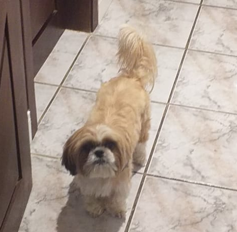

## 🌟 Bem vindo! | Welcome! 🌟
🇧🇷: Meu nome é José Ivo e eu sou graduando do curso de Tecnologia da Informação da Universidade Federal do Rio Grande do Norte.

🇺🇸: My name is José Ivo, and I am a undergraduate student of the Information Technology program in the Federal Rio Grande do Norte University.

---
## Sobre mim | About me
🇧🇷: Sou bolsista do Projeto de Educação Tutorial do curso de Ciência da Computação e sempre fui apaixonado por resolução de problemas lógicos. Também tenho um cachorro.

🇺🇸: I am part of the Tutorial Education Project of the Computer Science course (PETCC) and I was always in love with solving logical problems. I also have a dog.

---
## Interesses | Interests
- Desenvolvimento web | Web development  🌐
- Sistemas Unix-like | Unix-like systems 🐧
- Desenvolvimento de jogos | Game development 🎮
- Matemática demonstrativa | Demonstrative mathematics 📝

🇧🇷: E também âmbitos interdisciplinares relacionados com TI, como arte generativa (não plágios feitos por IA, projetos artísticos de verdade), TI para educação, etc.

🇺🇸: And also inter-disciplinary areas related with IT, like generative art (not AI plagiarism, real artistic projects), educational technology, etc.

---

<!---
schwaad/schwaad is a ✨ special ✨ repository because its `README.md` (this file) appears on your GitHub profile.
You can click the Preview link to take a look at your changes.
--->
